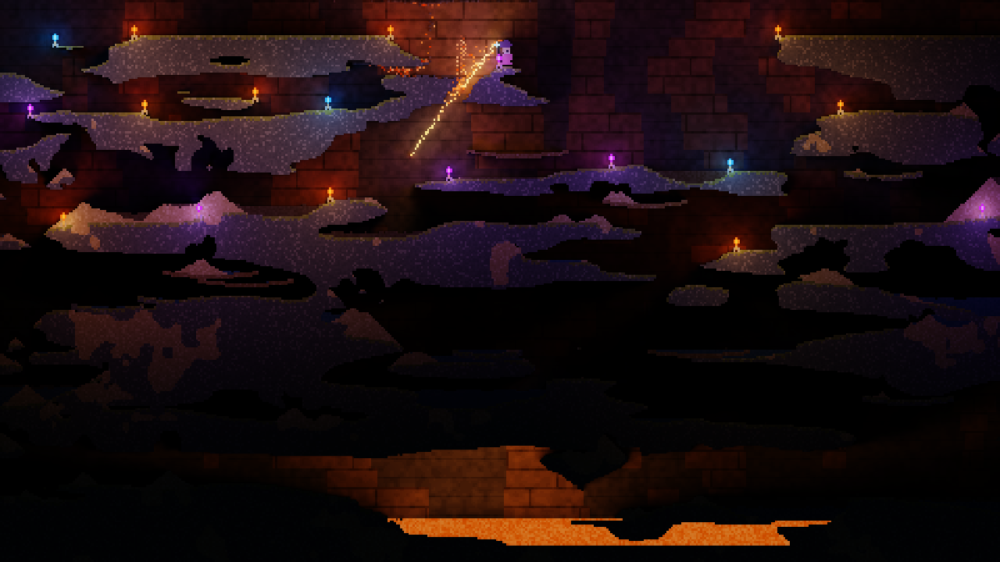

# pixi-rcgi

Radiance-cascades global illumination for [PixiJS](https://pixijs.com) v8.



Tag what emits light and what blocks it. <br/>
Everything else is lit background, but it neither emits nor blocks.

Occluders are lit by fake point lights, auto-generated by emissive containers.

**[Live demo](https://chamchi0809.github.io/pixi-GI/)** · [API reference](packages/lib/README.md)

## Install

```bash
npm i pixi-rcgi
```

You need `pixi.js ^8.6.0`.

## Getting started

Build your scene in a `Container` that is **not** on the stage, and add
`gi.view` instead.

```ts
import { Application, Container, Sprite, UPDATE_PRIORITY } from "pixi.js";
import { RadianceCascades, setMaterial } from "pixi-rcgi";

const app = new Application();
await app.init({ preference: "webgl" }); // WebGL only
document.body.appendChild(app.canvas);

const world = new Container();
world.addChild(floor, wall, torch);

setMaterial(wall, { occlusion: 1 }); // casts shadows
setMaterial(torch, { emissive: 0xffb347, emissiveIntensity: 4 }); // emits light
// `floor` is untagged, so it is lit but invisible to the lighting

const gi = new RadianceCascades({
  renderer: app.renderer,
  world,
  ambient: 0x0a0d14, // so unlit corners are not pure black
  occluderAmbient: 0x141821, // floor brightness for walls and other casters
});

app.stage.addChild(gi.view);
app.ticker.add(() => gi.render(), null, UPDATE_PRIORITY.HIGH);
```

Move the camera by moving `world`; call `gi.resize(w, h)` on canvas resize.

### Materials

`setMaterial(target, material)` applies to the whole subtree; tag a child to
override.

| field                                        |                                                                          |
| -------------------------------------------- | ------------------------------------------------------------------------ |
| `emissive`                                   | Emitted colour, multiplied by the object's pixels. Omit to emit nothing. |
| `emissiveIntensity`                          | Radiance multiplier, default `1`. `2..10` for a solid lamp.              |
| `occlusion`                                  | `0..1`, default `1`. `0` is a glow that casts no shadow.                 |
| `emissiveMap` / `occlusionMap` / `normalMap` | Per-pixel versions of the above.                                         |

Intensity is radiance _per lighting pixel a ray crosses_, so a wide
`occlusion: 0` glow accumulates it — a 100px soft glow wants `0.2`, not `4`.

### Sharpness

```ts
new RadianceCascades({ renderer, world, resolution: 1, probeSpacing: 1 });
```

Irradiance is sampled every `probeSpacing / resolution` screen pixels — 4px at
the defaults, which reads as blur. `1`/`1` is pixel-crisp for ~1.5× the cost.
Both are fixed at construction.
[Measurements](packages/lib/README.md#sharpness-resolution-x-probespacing).

The [reference](packages/lib/README.md#limitations) has the full list and the
reasoning behind each one.

## Credits

Radiance cascades is Alexander Sannikov's technique.

Platformer art:
[Platformer Art Complete Pack](https://kenney.nl/assets/platformer-art-complete-pack-now-with-enemies)
by Kenney Vleugels, CC0.

## License

MIT.
